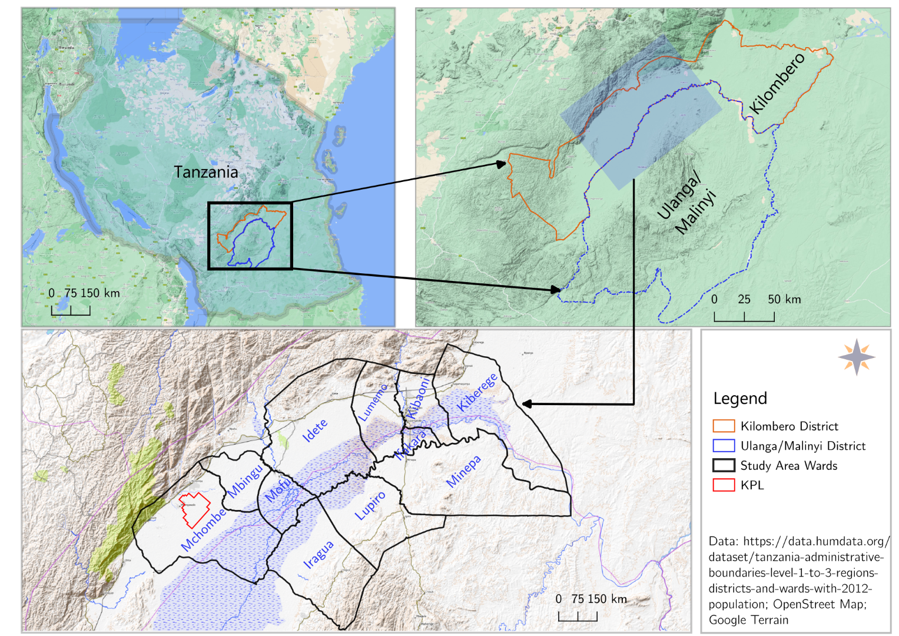
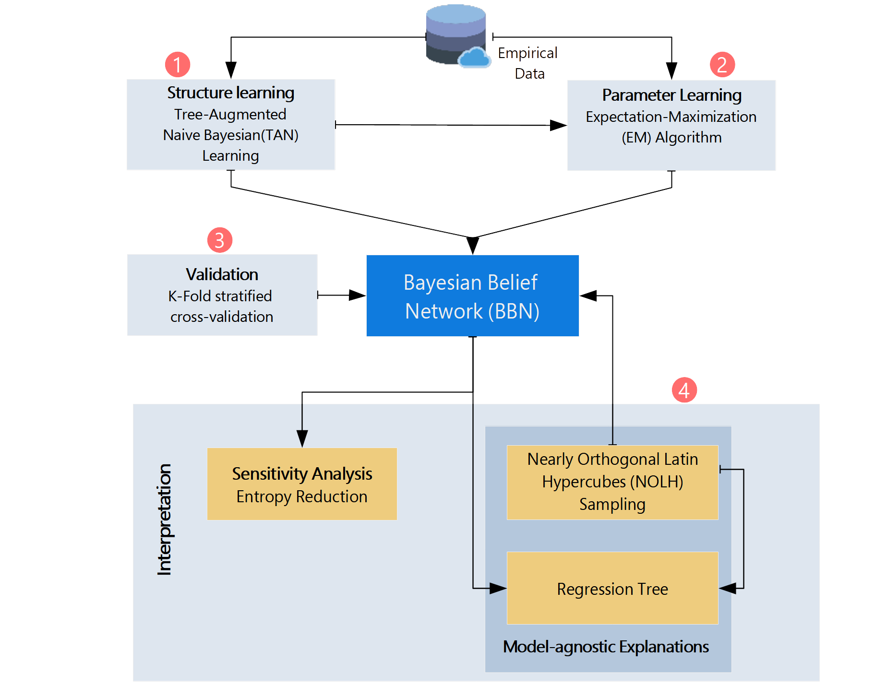
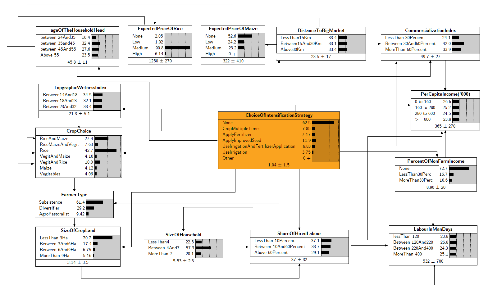
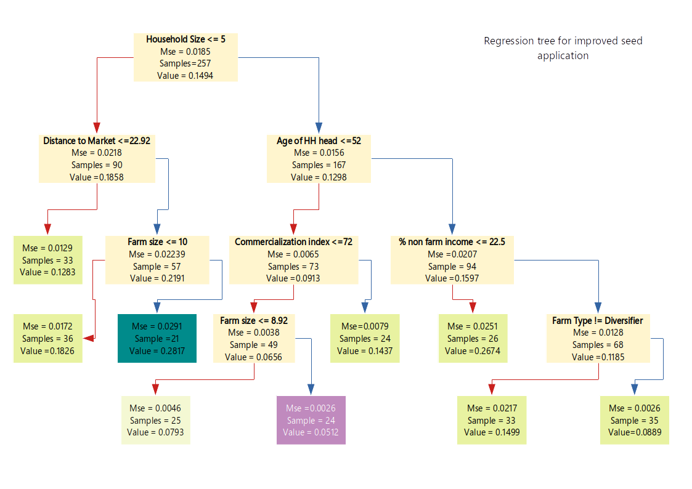

     
    <h1>Modeling Intensification decision in Kilombero Valley Floodplain: A Bayesian Belief Network Approach</h1>

***

This repository contains the code, data and visualization for the paper titled `Modeling Intensification decision in Kilombero Valley Floodplain: A Bayesian Belief Network Approach`. We developed a Bayesian Belief Network using [Netica](https://www.norsys.com/netica-j.html) java API and application to model both the structure and parameters of the model. The structure is learned using TAN(`Tree-augmented Naive Bayesian`)[1](#myfootnote1) and the parameters are learned using `Expectation maximization` algorithm. To identify state specific factors we augmented the BBN approach with Design of experiment and regression tree. The repo also contains the data and a jupyter notebook for the regression tree analysis.

# Table of contents

- [Table of contents](#table-of-contents)
- [Study Site ](#study-site-)
- [ Modeling Framework](#-modeling-framework)
- [ Data](#-data)
- [ Java-Code](#-java-code)
- [ Regression Tree](#-regression-tree)
- [ Licenses](#-licenses)

# Study Site 

This study was conducted in the Kilombero Valley Floodplain (KVF), Tanzania. The low altitude plain with alluvial deposits has a productive natural resource base with fertile land, reliable water availability and extensive pastures (Bamford et al., 2010; Nindi et al., 2014). Located in the Ulanga and Kilombero Districts in southern Tanzania, it forms one of the four principal sub-basins of the Rufiji River Basin and comprises a myriad of rivers and seasonally flooded marshes and swamps (Dinesen, 2016).The seasonal change in water dynamic is huge and the plains sometimes becomes totally flooded during the wet season, while it dries up during the dry season with the exception of the rivers and river margins as well as of the areas with permanent swamps and water bodies (Kato, 2007; Ntongani, Munishi, More, & Kashaigili, 2014).

#  Modeling Framework

#  Data

We conducted a household survey in 21 villages in two Districts of the Kilombero Valley, Ulanga and Kilombero. In total, 304 farm households were interviewed using a Standard questionnaire; giving their opinions upon a wide range of topics. The survey was designed to discover the farming system in terms of resources, land use and sources of livelihoods. In the links below you will find the data  (for the paper), survey instrument and descriptive statistics: 

  - <a href="./Data/">Data</a>
  - <a href="./Data/SurveyInstrument_Tanzania.pdf"> Questionnaire</a>
  - <a href="./docs/CharacterizingFarmers_3.html"> Descriptive statistics</a>

#  Java-Code 

We developed a bayesian belief network using [Netica](https://www.norsys.com/netica-j.html) java API to model both the structure and parameters of the model. The structure is learned using TAN(`Tree-agumented Naive Bayesian`)algorithm and the parameters are learned using `Expectation maximization`algorithm. Netica provides a number of simplifying tasks for the modeler including a high visual capability to display  the network and advanced algorithms to learn the structure and parameters of the network. Using the Java API for the construction of BBNs provides an advantage in terms of transparency, reproducibility and easy integration with other modeling tools of interest as it resulted in Java source code. The code is structures in to the following packages
- [Build](./BBNwithNeticaJ/src/Com/Build/)
- [CrossValidation](./BBNwithNeticaJ/src/Com/CrossValidation/)
- [Display](./BBNwithNeticaJ/src/Com/Display/)
- [MainModel](./BBNwithNeticaJ/src/Com/MainModel/)
- [Sensitivity](./BBNwithNeticaJ/src/Com/Sensitivity/)

***

***

#  Regression Tree

To identify state specific factors we augmented the BBN approach with Design of expermint and regression tree. The repo also contains the data and a jupyter notebook for the regression tree analysis. Go [Here](./RegressionTree/SensistivityAnalysisFinal.ipynb) for the code and detailed results of our sensistivity analysis.

***
#  Licenses 
This program is free software: you can redistribute it and/or modify it under the terms of the GNU General Public License as published by the Free Software Foundation,version 3 of the License.
This program is distributed in the hope that it will be useful,but WITHOUT ANY WARRANTY; without even the implied warranty of MERCHANTABILITY or FITNESS FOR A PARTICULAR PURPOSE.  See the GNU General Public License for more details. You can find the copy of the GNU General Public License [Here](./BBNwithNeticaJ/LICENSE). The source code for [NeticaJ](https://www.norsys.com/netica-j.html) is licensed under NORSYS LICENSE AGREEMENT FOR NETICA- Norsys Agreement #116. You can find the copy of the license [Here](./BBNwithNeticaJ/LicAgree.txt)

***

<a name="myfootnote1">1</a>: The structure is learned using the application version of Netica

